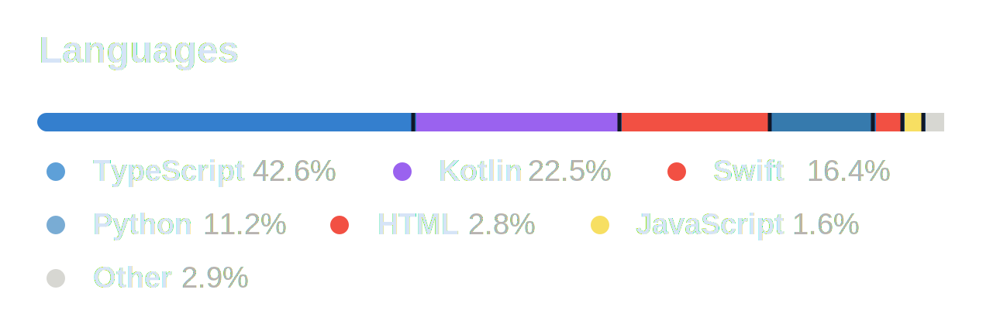
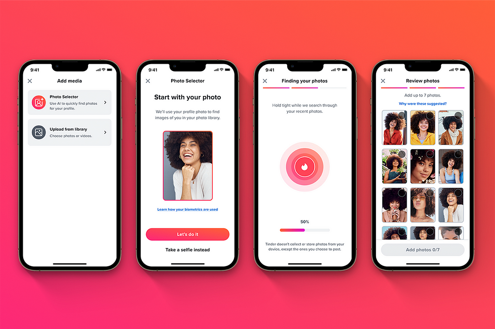

<!-- _class: title -->

## LLM으로 영향력 넓히기

---

# 입사 1주차

<h2>첫 과제</h2>
<blockquote>
iOS 앱에 기능 하나 구현해주세요.
</blockquote>

<h2>내 머릿속</h2>
<blockquote>
네 제가요????? 
Swift로 헬로 월드도 모르는데요?
</blockquote>

1. **알고 있던 것**
   1. React, TypeScript, 논문용 프로토타입
2. **갑자기 해야 했던 것**
   1. iOS 앱 구조 읽기
   2. Swift 문법 익히기
   3. 실제 제품 코드에 기능 넣기

---

<!-- _class: no-footer -->

# 입사 6개월차

6개월차 신입이 FE BE Android iOS ML에 디자인까지 하게 된 이야기

---

<!-- _class: clean-slide -->

# 왜 이렇게 많은 스택을 하게 됐나

온디바이스부터 LLM까지 각 ML 컴포넌트들이 복잡하게 연결되어 있는 프로젝트

---

<!-- _class: secret-slide -->

# 1인 6역의 비밀

  

    AI를 이용한 지식 전이 학습법
  

  

    AI를 이용한 디테일 채우기
  

  

    AI를 이용한 멀티 태스크 매니징
  

---

<!-- _class: single-secret-slide -->

  AI를 이용한 지식 전이 학습법

---

<!-- _class: transfer-slide -->

# AI를 이용한 지식 전이 학습법

  

    
책

    
YouTube 강의

    
공식 문서

  

  
→

  

    AI가 만드는
    나에게 최적화된 강의 자료
    이미 아는 개념을 발판으로 새 기술을 설명한다
  

<blockquote class="transfer-quote">
처음부터 배우는 게 아니라, 이미 아는 지식에 새 개념을 붙인다.
</blockquote>

---

<!-- _class: transfer-slide -->

# React/TypeScript에서 다른 언어로

  

    

      
      
    

    <h2>내가 이미 익숙한 세계</h2>
    
문법, 컴포넌트 구조, 비동기 흐름, 아키텍처 감각

  

  

    GPT에게 항상 이렇게 묻기
    <strong>“Swift의 이 개념을 TypeScript 개념과 대응시켜서 공통점과 차이점 위주로 설명해줘.”</strong>
  

  

    

      GPTs
      Gems
    

    
    <strong>내 개인 Swift 선생님</strong>
    <small>내 배경지식을 아는 튜터</small>
  

---

<!-- _class: transfer-slide -->

# 예시: 동시성이라는 하나의 개념

  

    
    <strong>JavaScript</strong>
    Event Loop
    <small>내가 처음 알고 있던 모델</small>
  

  

    <b class="same-icon">🤝</b> 기다리는 동안 일하기
     Promise → Coroutine
  

  

    
    <strong>Python</strong>
    asyncio
  

  

    <b class="same-icon">🤝</b> 구조적 동시성
     Single Event Loop → Multi-core
  

  

    
    <strong>Swift</strong>
    Swift Concurrency
  

---

<!-- _class: single-secret-slide -->

  AI를 이용한 디테일 채우기

---

<!-- _class: detail-fill-slide -->

# AI를 이용한 디테일 채우기

  

    여러 스택의 스펙
    

      iOS
      Android
      JavaScript
      TypeScript
      React Native
      PyTorch
      FastAPI
      LiteRT
      XNNPack
    

  

  
→

  

    공통 구조로 추상화
    

      동시성 모델
      데이터 흐름
      상태 관리
      리소스 경계
      통신 비용
      실행 그래프
    

  

  
→

  

    AI가 채우는 디테일
    

      Kotlin 코드
      Swift 코드
      TypeScript 코드
      학습 코드
      FastAPI 엔드포인트
    

  

<blockquote class="detail-bottom">
내 역할은 모든 문법을 기억하는 것이 아니라, 올바른 구조를 설계하고 검증하는 것이다.
</blockquote>

---

<!-- _class: detail-fill-slide concurrency-review-slide -->

# 동시성은 문법보다 실행 모델이 중요하다

  

    플랫폼별 문법
    

      

        
        <strong>iOS</strong>
        async/await · actor · MainActor
      

      

        
        <strong>Android</strong>
        coroutine · dispatcher · lifecycle scope
      

      

        
        <strong>JavaScript</strong>
        event loop · promise · worker
      

    

  

  
→

  

    공통 위험 구조
    

      race condition
      main thread blocking
      shared state mutation
      lifecycle 밖에서 도는 task
    

  

  
→

  

    검토자의 시야
    
실행 위치

    
취소와 정리

    
공유 상태 접근

    
UI 업데이트 경계

  

<blockquote class="concurrency-bottom">
AI가 코드를 써도, 내가 검증하는 것은 문법이 아니라 실행 모델이다.
</blockquote>

---

<!-- _class: detail-fill-slide architecture-slide -->

# 같은 앱을 두 번 만들지 않는 아키텍처

  

    하나의 공통 설계도
    

      Domain Model
      State Machine
      Data Flow
      Repository Boundary
      Concurrency Policy
      Error Handling
      Observability
    

  

  
→

  

    

      
      <strong>iOS Implementation</strong>
      SwiftUI / UIKit
      platform API
      lifecycle glue
    

    

      
      <strong>Android Implementation</strong>
      Kotlin / Compose
      platform API
      lifecycle glue
    

  

---

<!-- _class: detail-fill-slide unfamiliar-slide -->

# 처음 보는 기술 문장도, 문제의 층위를 찾으면 다룰 수 있다

  
  PAN head activation에 GELU Activation head로 인해 XNNPack 연산이 44개의 partition으로 나뉘어서 XNNPack과 LiteRT 사이에 delegation이 너무 많이 일어납니다.

  

    1
    <strong>낯선 단어</strong>
    
PAN, GELU, ReLU6, XNNPack, LiteRT, delegate graph

  

  

    2
    <strong>추상화</strong>
    
두 컴포넌트 사이의 통신비용 증가

  

  

    3
    <strong>AI를 활용한 해결</strong>
    
통신/전환 비용을 줄이는 연산 후보와 재학습, 벤치마크 코드를 제안받는다

  

<blockquote class="unfamiliar-bottom">
목표는 모든 디테일을 즉시 이해하는 것이 아니라, “어느 층의 문제인지” 파악하는 것이다.
</blockquote>

---

<!-- _class: single-secret-slide -->

  AI를 이용한 멀티 태스크 매니징

---

<!-- _class: multitask-slide autonomy-slide -->

# 업무를 나누는 기준: AI가 얼마나 자율적으로 돌 수 있는가

  

    짧은 케이던스
    <strong>사람이 자주 봐야 하는 일</strong>
    
눈으로 보고, 감각으로 판단하고, 빠르게 다시 지시한다.

  

  

    
Design

    
FE

    
Mobile

    
Backend

    
ML Modeling

  

  

    긴 케이던스
    <strong>AI에게 오래 맡길 수 있는 일</strong>
    
실험, 테스트, 로그처럼 스스로 피드백을 받을 수 있다.

  

---

<!-- _class: multitask-slide rl-loop-slide -->

# AI가 혼자 전진하려면 피드백 루프가 있어야 한다

  

    Agent
    <strong>LLM</strong>
  

  

    Action
    <small>코드 작성 · 실험 설계 · 수정</small>
  

  

    Environment
    <strong>실행 환경</strong>
  

  

    Reward / Observation
    <small>점수 · 테스트 · 로그 · 출력</small>
  

  

    <strong>ML</strong>
    
실험을 돌리고 metric을 받아 다음 실험을 정한다.

    
특정한 조건이 만족될 때까지 무한히 반복할 수 있다.

  

  

    <strong>Backend</strong>
    
계약 문서, 테스트, 통합 결과로 수정 방향을 찾는다.

    
간혹 안되는 경우가 있다.

  

  

    <strong>Design/FE</strong>
    
보상 함수가 결국 사람의 눈이라 자동화 할 수 없다.

  

---

<!-- _class: multitask-slide queue-slide -->

# 여러 큐를 나누면 내 집중력을 더 효율적으로 쓸 수 있다

  

    

      Long Running Queue
      <strong>AI에게 맡겨두는 일</strong>
      

        
ML 실험

        
모델 벤치마크

        
리팩터링

      

    

    

      Standard Queue
      <strong>중간 점검으로 굴리는 일</strong>
      

        
Backend

        
모바일 기능

        
테스트 수정

      

    

    

      Human Focus Queue
      <strong>내 눈으로 반복하는 일</strong>
      

        
디자인 확인

        
FE polish

        
UX 동작 검토

      

    

  

  

    ←
    ←
    ←
  

  

    <strong>New Task</strong>
    
이것은 어떤 큐인가?

  

---

<!-- _class: closing-line-slide -->

# LLM은 나의 능력을 증폭시키는 도구이다

---

<!-- _class: closing-line-slide -->

# LLM은 모든 일을 할 수 있게 해주는 도구이다
